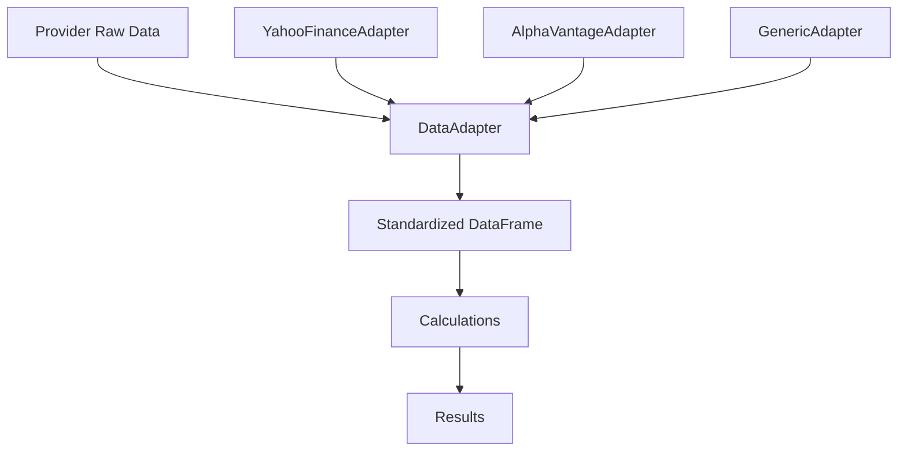
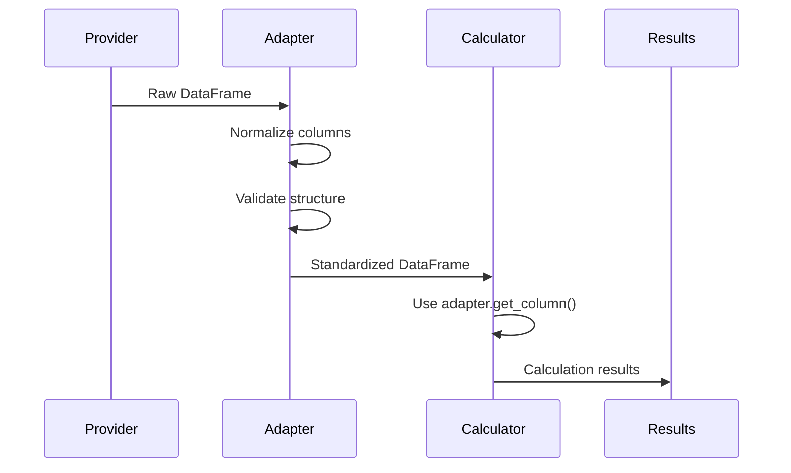
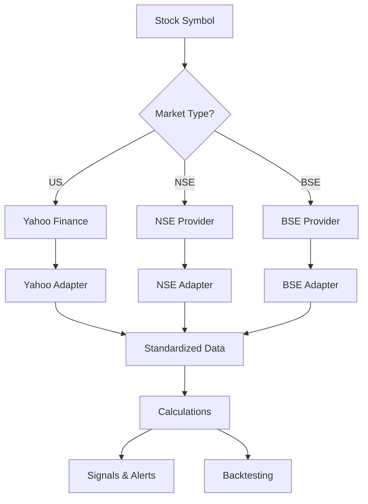
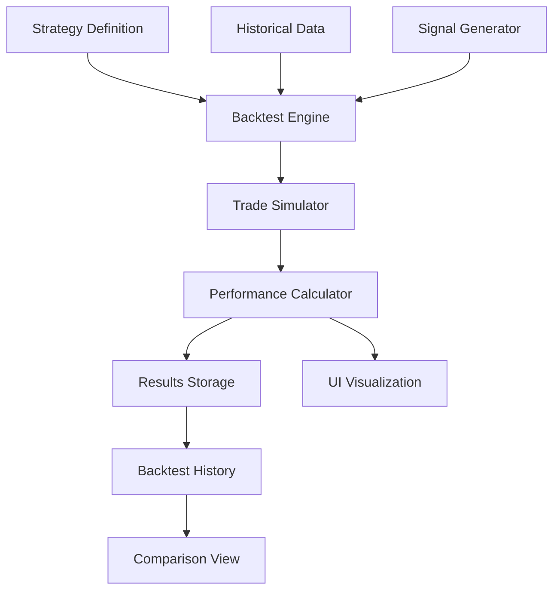
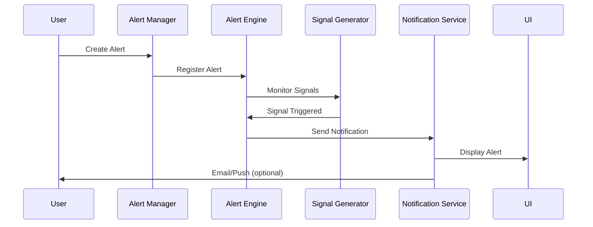

# Data Provider Abstraction & Code Enhancement Plan

## Current State Analysis

### Implemented Features

- ✅ Multiple data providers (Yahoo Finance, Alpha Vantage)
- ✅ Abstract base class `StockDataProvider`
- ✅ Factory pattern for provider management
- ✅ Enhanced parallel analysis system
- ✅ Advanced technical indicators (RSI, MACD, Bollinger Bands, Stochastic, ADX, ATR, CCI, Ichimoku)
- ✅ Pattern recognition (candlestick and chart patterns)
- ✅ Multi-timeframe analysis
- ✅ Entry point detection and signal scoring
- ✅ Risk calculations
- ✅ Basic UI with single and mass analysis
- ✅ Report generation (Excel, Word)
- ✅ Google Drive integration

### Critical Issues Identified

1. **No Data Abstraction Layer**: Direct column access (`data['Close']`, `data['High']`) throughout codebase
2. **Provider-Specific Normalization**: Each provider normalizes differently, making it hard to add new providers
3. **Inconsistent Constant Usage**: Constants exist (`COLUMN_CLOSE`, `COLUMN_OPEN`) but many places hardcode strings
4. **No Standardized Data Schema**: Internal calculations assume specific column names without validation
5. **Limited Test Coverage**: Only one test file found
6. **Code Correctness Issues**: Direct DataFrame access without validation, potential KeyError risks
7. **No Indian Stock Support**: Only US stocks supported currently
8. **Limited UI Features**: No notifications, alerts, advanced export, or backtesting
9. **No User-Friendly Interface**: UI assumes trading knowledge
10. **No Strategy Backtesting**: Cannot test strategies or track profit/loss

## Solution Architecture

### Phase 1: Data Adapter Layer (Core Abstraction)

Create a unified data adapter system that:

- Maps provider-specific keys/columns to internal standard keys
- Provides a standardized interface for all data access
- Validates data structure and provides defaults
- Is used internally for all calculations

**Files to Create:**

- `models/data_schema.py`: Defines internal data schema and standard column names
- `services/data_providers/adapters/data_adapter.py`: Base adapter class
- `services/data_providers/adapters/yahoo_finance_adapter.py`: Yahoo Finance specific adapter
- `services/data_providers/adapters/alpha_vantage_adapter.py`: Alpha Vantage specific adapter
- `services/data_providers/adapters/adapter_factory.py`: Factory for creating adapters

**Key Components:**

```python
# models/data_schema.py
class StandardDataSchema:
    """Defines standard internal data structure."""
    COLUMNS = {
        'OPEN': 'open',
        'HIGH': 'high',
        'LOW': 'low',
        'CLOSE': 'close',
        'VOLUME': 'volume',
        'ADJ_CLOSE': 'adj_close'
    }
    
# services/data_providers/adapters/data_adapter.py
class DataAdapter(ABC):
    """Abstract base class for data adapters."""
    def normalize_dataframe(self, df: pd.DataFrame) -> pd.DataFrame:
        """Convert provider-specific DataFrame to standard format."""
        
    def get_column(self, df: pd.DataFrame, column_type: str) -> pd.Series:
        """Get standardized column from DataFrame."""
        
    def validate_data(self, df: pd.DataFrame) -> bool:
        """Validate DataFrame has required columns."""
```


### Phase 2: Update All Calculations to Use Adapter

Replace all direct column access with adapter methods:**Files to Update:**

- `services/analyzers/analysis/technical_analysis.py`
- `services/analyzers/indicators/intraday_indicators.py`
- `services/analyzers/indicators/volume_indicators.py`
- `services/analyzers/indicators/momentum_indicators.py`
- `services/analyzers/patterns/candlestick_patterns.py`
- `services/analyzers/patterns/chart_patterns.py`
- `services/analyzers/signals/entry_detector.py`
- `services/analyzers/risk/risk_calculator.py`
- `services/data_providers/data_preprocessor.py`
- `core/enhanced_analyzer.py`

**Pattern to Follow:**

```python
# Before
close = data['Close']
high = data['High']

# After
adapter = DataAdapterFactory.get_adapter(provider_name)
close = adapter.get_column(data, 'CLOSE')
high = adapter.get_column(data, 'HIGH')
```


### Phase 3: Update Providers to Use Adapter

Modify providers to use adapters for normalization:**Files to Update:**

- `services/data_providers/providers/yahoo_finance_provider.py`
- `services/data_providers/providers/alpha_vantage_provider.py`
- `services/data_providers/yahoo_finance/yahoo_finance_service.py`

**Changes:**

- Providers return raw data
- Adapter layer handles normalization
- Providers focus only on fetching, not normalization

### Phase 4: Add Comprehensive Testing

Create test suite for:

- Data adapter functionality
- Provider integration
- Calculation correctness
- Edge cases and error handling

**Files to Create:**

- `tests/unit/test_data_adapter.py`
- `tests/unit/test_providers.py`
- `tests/unit/test_technical_analysis.py`
- `tests/unit/test_indicators.py`
- `tests/unit/test_patterns.py`
- `tests/integration/test_provider_integration.py`
- `tests/fixtures/sample_data.py`

### Phase 5: Code Correctness & Enhancements

**Fixes:**

1. Add input validation to all calculation functions
2. Handle missing data gracefully
3. Add type checking and validation
4. Fix potential KeyError issues
5. Add proper error messages

**Enhancements:**

1. Add data quality metrics
2. Add data validation reports
3. Improve error handling and logging
4. Add data caching improvements
5. Add performance optimizations

### Phase 6: Indian Stock Market Support

**Objective**: Test and integrate libraries for Indian stock data (NSE, BSE)**Libraries to Test:**

1. **yfinance** (with `.NS` suffix for NSE, `.BO` for BSE)
2. **nsepy** - NSE Python library
3. **nsetools** - NSE data fetcher
4. **investpy** - Investing.com data (supports Indian stocks)
5. **pandas_datareader** - Multiple sources
6. **bsepy** - BSE data library
7. **stock-india** - Indian stock market library

**Testing Strategy:**

- Test each library for:
- Historical data availability (1m, 5m, 15m, 1h, 1d intervals)
- Live/real-time data support
- Data completeness (OHLCV, volume, market data)
- API rate limits and stability
- Error handling and reliability
- Data format consistency

**Implementation Approach:**

- Use best library for each purpose (e.g., nsepy for historical, nsetools for live)
- Create provider adapters for each library
- Support both NSE and BSE exchanges
- Handle Indian market-specific features (circuit breakers, settlement dates)

**Files to Create:**

- `services/data_providers/providers/nse_provider.py`
- `services/data_providers/providers/bse_provider.py`
- `services/data_providers/providers/investpy_provider.py`
- `services/data_providers/adapters/nse_adapter.py`
- `services/data_providers/adapters/bse_adapter.py`
- `tests/integration/test_indian_stocks.py`
- `docs/INDIAN_STOCKS_SETUP.md`

### Phase 7: Enhanced UI for Data Export

**Features:**

1. **Advanced Export Interface**:

- Filter by stock symbols (multi-select)
- Date range picker (start/end dates)
- Data type selection (technical, fundamental, signals, patterns, all)
- Export format (Excel, Word, CSV, JSON, PDF)
- Include/exclude specific indicators
- Custom report templates

2. **Export Criteria Builder**:

- Visual query builder for complex filters
- Save export presets
- Scheduled exports
- Batch export with progress tracking

**Files to Create:**

- `ui/components/export_builder.py`
- `ui/components/export_criteria.py`
- `services/exporters/advanced_exporter.py`
- `models/export_config.py`

### Phase 8: Notifications & Alerts System

**Features:**

1. **Alert Types**:

- Price alerts (above/below threshold)
- Signal alerts (buy/sell signals)
- Pattern alerts (pattern detection)
- Volume alerts (unusual volume)
- Risk alerts (high volatility, drawdown)

2. **Notification Channels**:

- In-app notifications
- Email notifications
- Browser push notifications (optional)
- SMS notifications (optional, future)

3. **Alert Management**:

- Create/edit/delete alerts
- Alert history
- Alert performance tracking
- Alert templates

**Files to Create:**

- `services/alerts/alert_manager.py`
- `services/alerts/alert_engine.py`
- `services/alerts/notification_service.py`
- `models/alert.py`
- `ui/components/alerts_panel.py`
- `ui/components/alert_creator.py`
- `config/constants/AlertConstants.py`

### Phase 9: User-Friendly UI for Non-Trading Users

**Design Principles:**

- Simple, intuitive language (avoid technical jargon)
- Visual indicators (colors, icons, charts)
- Step-by-step guidance
- Clear action buttons
- Educational tooltips

**Features:**

1. **Simplified Dashboard**:

- "Stocks to Watch" (green/red indicators)
- "Recommended Actions" (Buy/Hold/Sell with explanations)
- "Your Portfolio" (simple view)
- "Market Summary" (easy-to-understand metrics)

2. **Signal Interpretation**:

- "Strong Buy" → "Great time to invest"
- "Buy" → "Good opportunity"
- "Watch" → "Keep an eye on this"
- "Avoid" → "Not recommended right now"
- Show confidence levels in simple terms

3. **Educational Content**:

- Tooltips explaining indicators
- "Why this signal?" explanations
- Risk level indicators (Low/Medium/High)
- Simple charts with annotations

**Files to Create:**

- `ui/components/simple_dashboard.py`
- `ui/components/signal_interpreter.py`
- `ui/components/educational_tooltips.py`
- `services/interpreters/signal_translator.py`
- `config/constants/UIMessages.py`

### Phase 10: Backtesting System

**Features:**

1. **Strategy Backtesting**:

- Test signals against historical data
- Calculate profit/loss for each trade
- Track win rate, average profit, max drawdown
- Compare multiple strategies
- Visualize backtest results

2. **Backtesting Engine**:

- Simulate trades based on signals
- Account for transaction costs
- Handle different order types (market, limit)
- Support position sizing
- Risk management (stop-loss, take-profit)

3. **Backtesting UI**:

- Strategy selector
- Date range picker
- Initial capital input
- Transaction cost settings
- Results visualization (charts, tables)
- Performance metrics dashboard
- Export backtest reports

4. **Backtesting History**:

- Save all backtest runs
- Compare historical backtests
- Track strategy performance over time
- View detailed trade logs
- Export backtest history

**Files to Create:**

- `services/backtesting/backtest_engine.py`
- `services/backtesting/strategy_executor.py`
- `services/backtesting/performance_calculator.py`
- `models/backtest_result.py`
- `models/backtest_trade.py`
- `ui/components/backtest_runner.py`
- `ui/components/backtest_results.py`
- `ui/components/backtest_history.py`
- `services/storage/backtest_storage.py`
- `config/constants/BacktestConstants.py`

### Phase 11: Documentation & Constants

**Updates:**

- Create `config/constants/DataConstants.py` for all data-related constants
- Update existing constants files to use new schema
- Document adapter pattern in architecture docs
- Create migration guide for existing code
- Document Indian stock setup
- Create user guide for non-trading users
- Document backtesting features

## Implementation Details

### Data Adapter Pattern




### Data Flow




### Multi-Provider Architecture (US + Indian Stocks)




### Backtesting System Architecture




### Alert System Flow




## Testing Strategy

1. **Unit Tests**: Test each adapter independently with mock data
2. **Integration Tests**: Test provider → adapter → calculator flow
3. **Regression Tests**: Ensure existing functionality still works
4. **Edge Case Tests**: Empty data, missing columns, invalid data
5. **Performance Tests**: Measure adapter overhead

## Migration Path

1. Create adapter layer (non-breaking)
2. Update one module at a time
3. Run tests after each update
4. Keep old code until migration complete
5. Remove old code after full migration

## Implementation Priority

### Phase 1-5: Core Infrastructure (Critical)

- Data adapter layer
- Code correctness fixes
- Testing framework

### Phase 6: Indian Stock Support (High Priority)

- Test libraries first
- Implement stable providers
- Add adapters

### Phase 7-9: UI Enhancements (High Priority)

- Export features
- Notifications/alerts
- User-friendly interface

### Phase 10: Backtesting (Medium Priority)

- Core backtesting engine
- UI components
- History storage

### Phase 11: Documentation (Ongoing)

- Update as features are added

## Success Criteria

### Core Functionality

- ✅ All calculations use adapter, no direct column access
- ✅ New providers can be added by creating adapter only
- ✅ 80%+ test coverage
- ✅ All existing functionality works
- ✅ No performance degradation

### Indian Stock Support

- ✅ At least 2 stable libraries integrated
- ✅ Support for NSE and BSE
- ✅ Historical and live data working
- ✅ All technical indicators work with Indian stocks

### UI Enhancements

- ✅ Advanced export with criteria builder
- ✅ Notification/alerts system functional
- ✅ Simple dashboard for non-trading users
- ✅ All features accessible without trading knowledge

### Backtesting

- ✅ Backtest engine working with all strategies
- ✅ Profit/loss calculations accurate
- ✅ Backtest history stored and retrievable
- ✅ Visual results in UI