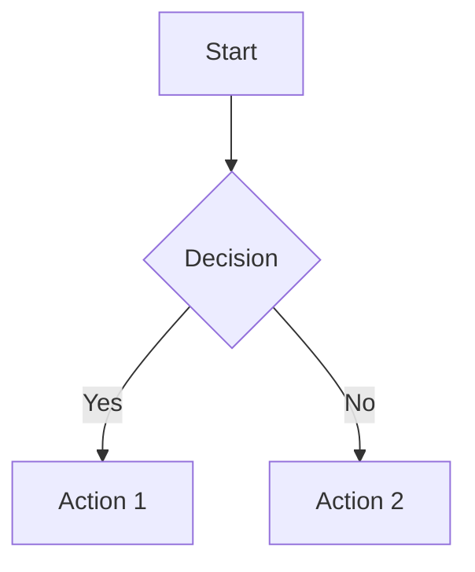

# Documentation Setup Guide

This guide explains how to set up and maintain the Stockport v4 documentation.

## Documentation Structure

Stockport v4 uses **MkDocs** with the **Material theme** for documentation, similar to the clouddesk project structure.

### Two Documentation Sites

1. **Developer Documentation** (`mkdocs.yml`)
   - Location: `docs/` directory
   - Audience: Developers working on the codebase
   - Topics: Architecture, API, backend components, testing

2. **User Documentation** (`mkdocs-user.yml`)
   - Location: `docs/user/` directory
   - Audience: End users of the system
   - Topics: How to use features, guides, troubleshooting

## Installation

### Install MkDocs and Dependencies

```bash
pip install mkdocs mkdocs-material pymdown-extensions
```

Or install from requirements:

```bash
pip install -r requirements.txt
```

## Serving Documentation

### Developer Documentation

```bash
# Serve locally (auto-reload on changes)
mkdocs serve

# Documentation available at:
# http://localhost:8000
```

### User Documentation

```bash
# Serve locally
mkdocs serve -f mkdocs-user.yml

# Documentation available at:
# http://localhost:8000
```

### Build Static Sites

```bash
# Build developer docs
mkdocs build

# Build user docs
mkdocs build -f mkdocs-user.yml

# Output directories:
# - site/ (developer docs)
# - site-user/ (user docs)
```

## Adding New Documentation

### 1. Create Markdown File

Create a new `.md` file in the appropriate directory:
- Developer docs: `docs/`
- User docs: `docs/user/`

### 2. Update Navigation

Edit the appropriate `mkdocs.yml` file:

```yaml
nav:
  - Your Section:
    - your-page.md
```

### 3. Test Locally

```bash
mkdocs serve
# or
mkdocs serve -f mkdocs-user.yml
```

### 4. Commit Changes

Documentation is version-controlled with the codebase.

## Documentation Guidelines

### Writing Style

- **Clear and concise**: Use simple language
- **Code examples**: Include working code examples
- **Diagrams**: Use Mermaid diagrams for complex concepts
- **Screenshots**: Add UI screenshots for user docs
- **Links**: Cross-reference related topics

### Markdown Features

MkDocs Material supports:
- Code highlighting
- Admonitions (notes, warnings, tips)
- Tables
- Mermaid diagrams
- Tabs
- Task lists
- Emojis

### Example Admonition

```markdown
!!! note "Important"
    This is a note with a title.

!!! warning
    This is a warning without a title.
```

### Example Mermaid Diagram

````markdown

````

## File Organization

### Developer Documentation Structure

```
docs/
├── index.md                    # Homepage
├── GETTING_STARTED.md          # Quick start guide
├── CHATGPT_COMPREHENSIVE_GUIDE.md  # AI assistant guide
├── architecture/               # Architecture docs
├── setup/                      # Setup guides
├── backend/                    # Backend component docs
├── api/                        # API documentation
├── frontend/                   # Frontend docs
├── testing/                    # Testing guides
└── operations/                 # Operations docs
```

### User Documentation Structure

```
docs/user/
├── index.md                    # Homepage
├── getting-started.md          # User onboarding
├── dashboard/                  # Dashboard guides
├── scanner/                    # Scanner guides
├── strategies/                 # Strategy guides
├── portfolio/                  # Portfolio guides
├── execution/                  # Execution guides
├── settings/                   # Settings guides
└── guides/                     # General guides
```

## Maintenance

### Regular Updates

- Update docs when features change
- Keep navigation organized
- Remove outdated content
- Add examples for new features

### Review Process

1. Test all links
2. Verify code examples work
3. Check formatting
4. Ensure navigation is logical
5. Update both user and dev docs

## References

- [MkDocs Documentation](https://www.mkdocs.org/)
- [Material Theme](https://squidfunk.github.io/mkdocs-material/)
- [Markdown Guide](https://www.markdownguide.org/)

