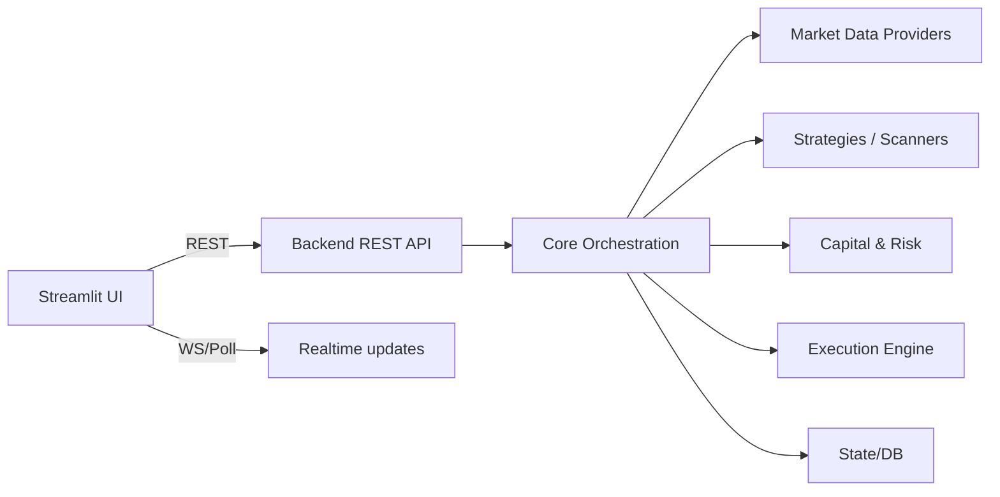

# Architecture Overview

Stockport is an algorithmic trading platform with two main surfaces:

- **Backend**: data ingestion, scanners/strategies, capital/risk logic, orders/execution, state.
- **UI (Streamlit Trading OS)**: a workspace-based “lens” over backend state (no new brain).

## Core principles

- **Always-on backend**: trading logic runs independently of the UI.
- **Separation of concerns**: UI renders; services fetch/derive; backend decides.
- **Safety first**: health monitoring + defensive defaults + kill-switch patterns.

## High-level component map

## Where to look in the repo

- `backend/`: backend services and APIs
- `ui/`: Streamlit app (`ui/app_v5.py`) and workspaces (`ui/workspaces/`)
- `services/`, `core/`, `models/`: analysis and domain modules
- `config/`: configuration and constants

