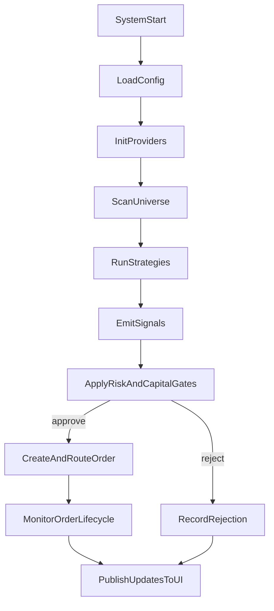

# End-to-end flow

This page gives the high-level system flow from startup to execution.

## Flow

## Notes

Each stage has its own failure modes; see [Operations troubleshooting](../operations/troubleshooting.md).

